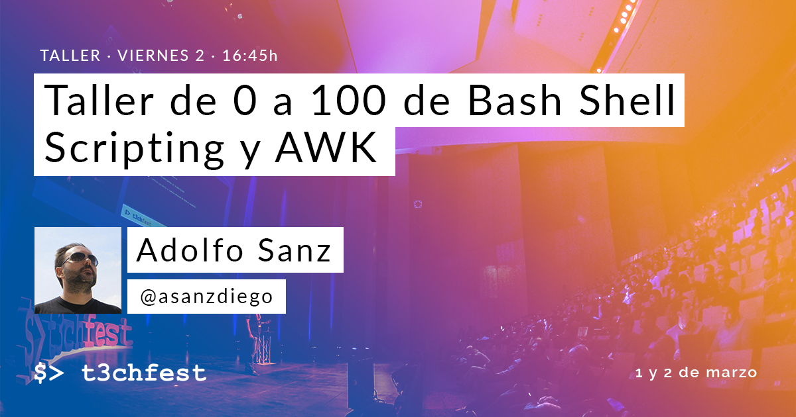

# Taller de 0 a 100 de Bash Shell Scripting y AWK

Desde que empecé con Linux hace años, la consola, los scripts y yo nos hemos ido conociendo poco a poco hasta que ha surgido una bonita amistad. Hoy, en cuanto me surge la oportunidad juego con ellos para automatizar casi cualquier cosa de mi sistema operativo.

En este taller quiero enseñar a programar scripts de Bash desde cero e ir subiendo la complejidad para terminar con AWK. Me basaré en un [curso de Bash Shell Script Avanzado](https://www.asanzdiego.com/2014/10/recursos-de-mi-curso-avanzado-de-bash-shell-script.html) que impartí hace tiempo.

[Taller en el T3chFest](https://t3chfest.uc3m.es/2018/programa/taller-100-bash-shell-scripting-awk/)

## Recursos

- [PDF - Chuleta Shell Script](https://github.com/asanzdiego/taller-shell-script-t3chfest-2018/raw/master/chuleta-shell-script.pdf)

- [PDF - Enunciados ejercicios](https://github.com/asanzdiego/taller-shell-script-t3chfest-2018/raw/master/taller-shell-script-enunciados.pdf)

- [PDF - Solución ejercicios](https://github.com/asanzdiego/taller-shell-script-t3chfest-2018/raw/master/taller-shell-script-soluciones.pdf)

- [Código - Enunciados ejercicios](https://github.com/asanzdiego/taller-shell-script-t3chfest-2018/tree/master/enunciados)

- [Código - Solución ejercicios](https://github.com/asanzdiego/taller-shell-script-t3chfest-2018/tree/master/soluciones)
